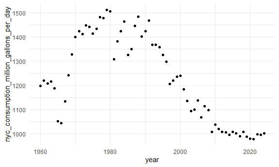

Reading data from the web
================

Load key packages.

``` r
library(rvest)
```

    ## 
    ## Attaching package: 'rvest'

    ## The following object is masked from 'package:readr':
    ## 
    ##     guess_encoding

``` r
library(httr) # For API
```

## Scraping

Import NSDUH data from the web

``` r
url = "https://samhda.s3-us-gov-west-1.amazonaws.com/s3fs-public/field-uploads/2k15StateFiles/NSDUHsaeShortTermCHG2015.htm"

drug_use_html = read_html(url)
# everything from this webpage were brought into here
```

This is an “easy” case

``` r
ndsuh_df = 
  drug_use_html |> 
  html_table() |> 
  first() |> # pulls out the first out of 15 tables
  slice(-1) # removes first row (which has caption information)
# not tidy because columns are encoding different variables, numerical columns are characters
# if html file is deleted, you can't access it unless you've downloaded it
# should export the dataset after tidying everything
```

Slightly harder case

``` r
url = "https://www.imdb.com/list/ls070150896/"

sw_html = 
  read_html(url)
```

Now pull out elements of the html that I care about.

``` r
title_vec = 
  sw_html |> 
  html_elements(".ipc-title-link-wrapper .ipc-title__text--reduced") |> 
  html_text() # only pulls out the text itself

metascore_vec = 
  sw_html |> 
  html_elements(".metacritic-score-box") |> 
  html_text()

runtime_vec = 
  sw_html |> 
  html_elements(".dli-title-metadata-item:nth-child(2)") |> 
  html_text()

sw_df = 
  tibble(
    title = title_vec,
    metascore = metascore_vec,
    runtime = runtime_vec
  )
```

## APIs

Get data using an API

Get the NYC water consumption dataset

``` r
nyc_water_df = 
  GET("https://data.cityofnewyork.us/resource/ia2d-e54m.csv") |> # CSV endpoint used
  content("parsed") # works to seperate the columns
```

    ## Rows: 65 Columns: 4
    ## ── Column specification ────────────────────────────────────────────────────────
    ## Delimiter: ","
    ## dbl (4): year, new_york_city_population, nyc_consumption_million_gallons_per...
    ## 
    ## ℹ Use `spec()` to retrieve the full column specification for this data.
    ## ℹ Specify the column types or set `show_col_types = FALSE` to quiet this message.

``` r
# status 200 means it worked

nyc_water_df |> 
  ggplot(aes(x = year, y = nyc_consumption_million_gallons_per_day)) +
  geom_point()
```



Access BRFSS

``` r
brfss_df = 
  GET(
    "https://chronicdata.cdc.gov/api/v3/views/acme-vg9e/query.csv",
    query = list("app_token" = "hBym4QiQDFerUXPrQwcA4VeP7")
  ) |> # need to sign up for a app token
  content("parsed")
# don't evaluate because it takes a long time
```

Look at Pokemon data

``` r
poke = 
  GET("http://pokeapi.co/api/v2/pokemon/2") |>
  content()

poke[[4]] # look at the fourth element
```

    ## [[1]]
    ## [[1]]$name
    ## [1] "ivysaur"
    ## 
    ## [[1]]$url
    ## [1] "https://pokeapi.co/api/v2/pokemon-form/2/"

``` r
# need to organize the elements of this API
```
